ОЦЕНКА 3
Создали файл sort.c

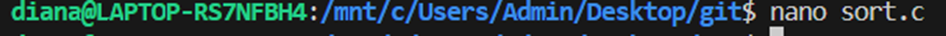 

Вставили код функции любой сортировки

Вот так сейчас выглядит git status

Добавили файл в область add

Смотрим как сейчас выглядит git status

Закоммитим файл в репозиторий

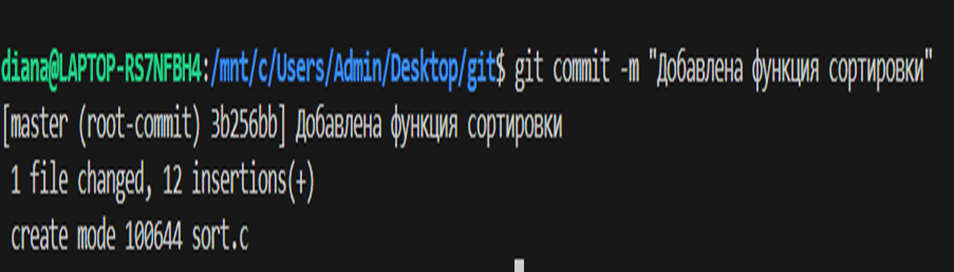

Смотрим, как сейчас выглядит git status

Добавляем комментарий с любым текстом в этот файл

 

Смотрим, как выглядит git status

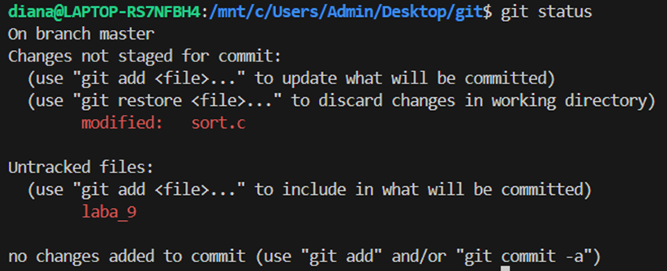

Добавляем add изменение файла

Смотрим, как выглядит git status 

Добавляем еще один комментарий

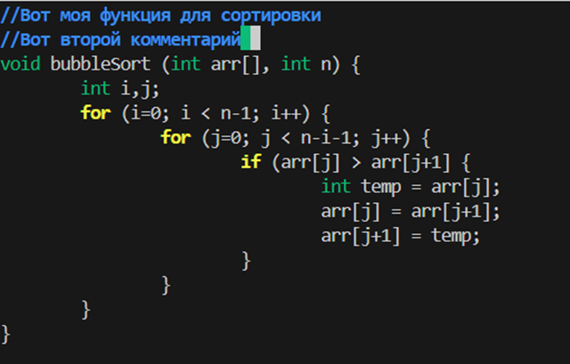

Делаем коммит

Смотрим, как выглядит git status

 

Смотрим, как выглядит журнал log

Добавляем в add

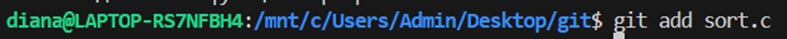

Коммитим

Запушим на git push

Используем git branch mybranch, чтобы создать новую ветку с именем mybranch

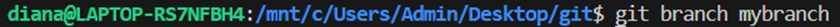.

Используем git branch, чтобы увидеть новую созданную ветку

Используем git switch mybranch, чтобы переключиться на новую ветку

Основное видимое изменение в выводе git status - это смена имени ветки и временное отсутствие информации о синхронизации с удаленным репозиторием для новой ветки

Убеждаемся, что мы находимся на своей ветке

Создаем файл file1.txt и своим именем

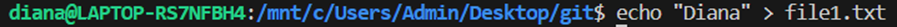

Добавляем файл

Коммитем изменение

 

Используйте git log --oneline --graph, чтобы увидеть, что ваша ветка указывает на новый коммит

Вернемся к ветке с именем master

Пропал коммит a54b0fa с file1.txt, так как он есть только в ветке mybranch

Создаем файл и коммитем его

Используем git log --oneline --graph --all, чтобы увидеть, что наша ветка указывает на новый коммит, и что теперь у двух веток разные коммиты

Переключаемся на вашу ветку mybranch

Проверяем наличие file2.txt

file2.txt пропал, так как каждый файл существует только в своей ветке.

Используем git diff mybranch master, чтобы увидеть разницу между двумя ветками.

ОЦЕНКА 4

Переключились на ветку mybranch

Перезаписали содержимое в sort.c добавили функцию main()

git diff отслеживает изменения

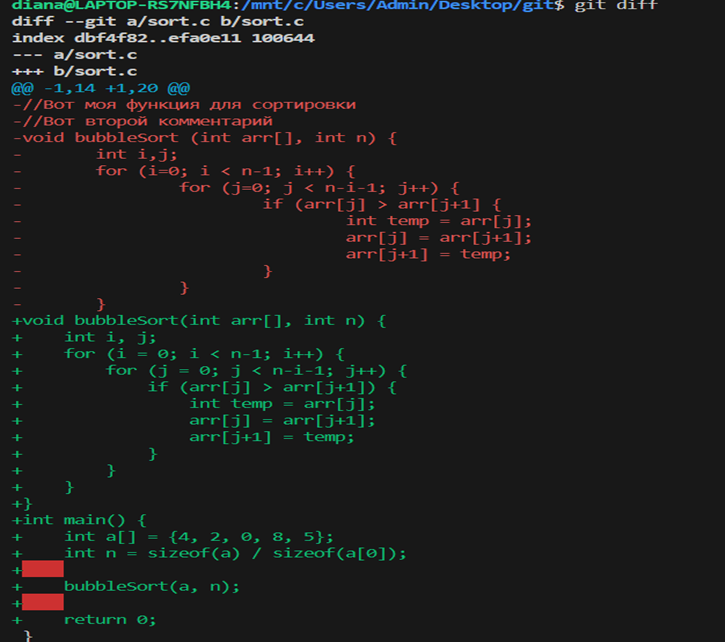

git diff --staged показывает, какие изменения будут сохранены в следующем коммите, а он у нас пустой

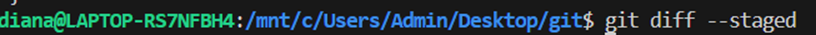

Добавила  в staged файл sort.c

git diff ничего не говорит, потому что в данный момент содержит одинаковую версию файла sort.c

git diff --staged показывает, какие изменения уже подготовлены для следующего коммита.

Удалила число 0 в массиве в sort.c

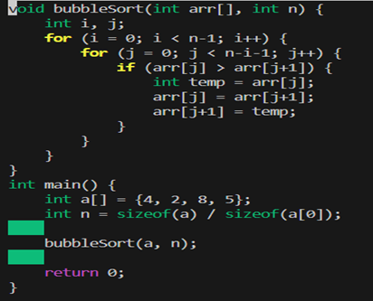

git diff  показывает изменения, он показал, что у мен исчезло число 0

git diff –-staged показывает нам, что подготовил к коммиту замену быстрой сортировки и добавил main(), но он не учитывает последнее изменение с удалением одного числа

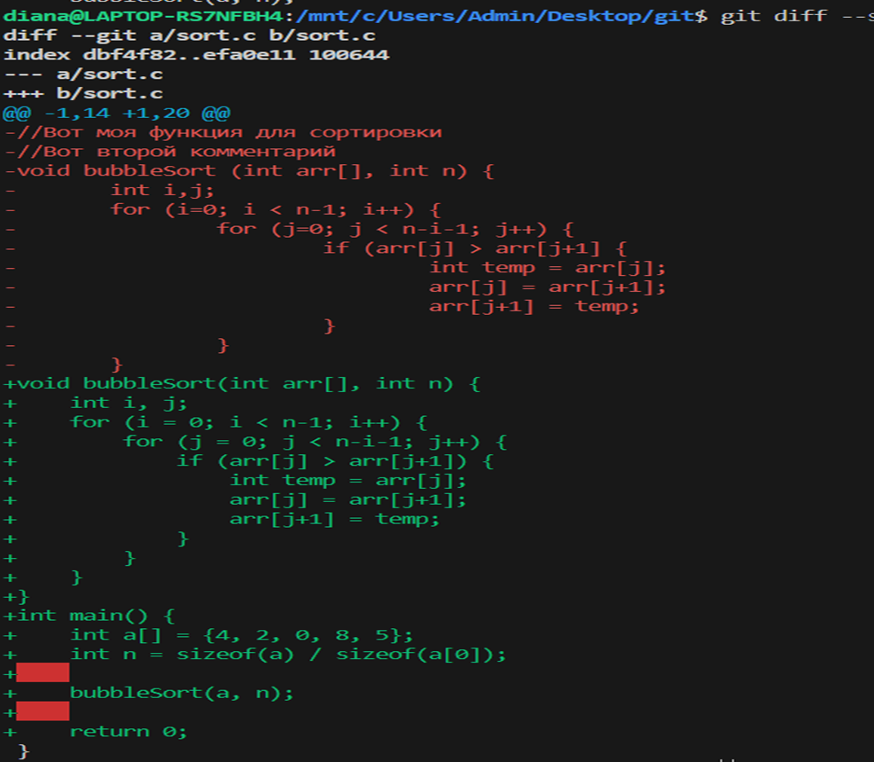

У нас в файле есть 3 состояния: 

1)Директория-то, что сейчас редактирую

2)Промежуточная зона-то, что подготовила к отправке

3)Репозиторий-то, что было в последнем коммите

Что я сделала:

git diff – удалила число 0 из массива

git diff –staged- заменила алгоритм сортировки и добавила функцию main

Запускаю git status и замечаю, что sort.c присутствует дважды в выводе

Запускаю git restore –staged sort.c, чтобы отменить индексацию изменения

Мы перенесли обратно из stage в VSCode

Индексирую изменение (add) и делаю коммит

Вот так выглядит журнал

Добавляю в sort.c в main() printf(“hello git\n”);

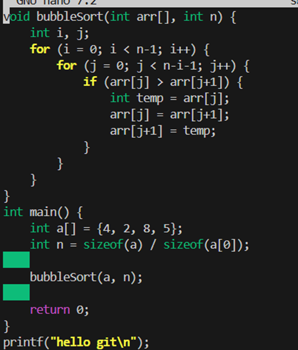

 Содержимое sort.c будет включать добавленную строку printf в main()

git status говорит, что файл sort.c изменен в моей рабочей директории, но эти изменения не подготовлены для следующего коммита

Запустила git restore sort.c

 Содержимое sort.c вернулось к состоянию последнего коммита (без printf)
git status говорит, что все синхронизировано с репозиторием git

Создала файл greeting.txt, проиндексировала его и закоммитила с сообщением “Add file greeting.txt”

Добавила  в этот файл слово hello, индексирую и коммичу с текстом "Add content to greeting.txt"

Создаю ветку с именем feature/uppercase

Переключилась на эту ветку

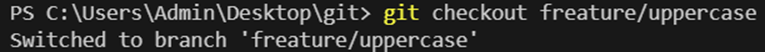

git status говорит, что я нохожусь в ветке freature/uppercase

Отредактировала  greeting.txt, чтобы он содержал приветствие в верхнем регистре (HELLO)

Добавила файл greeting.txt и закоммитела

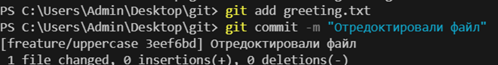

git brabch показывает на какой ветки мы сейчас находимся

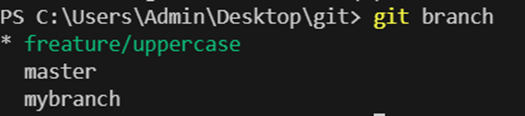

Он вывел все коммиты(визуальная структура ветвления, последовательность коммитов, расположение веток)

Переключилась на главную ветку

Использовала cat, чтобы увидеть содержимое файла greetings.txt

Сравниваю ветки

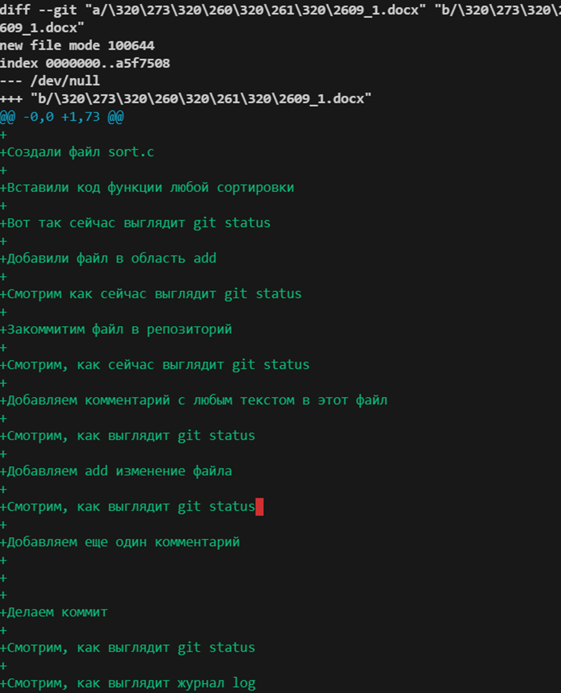

Объединила ветки

Использую cat, чтобы увидеть содержимое файла greetings.txt

Удалила ветку с заглавными буквами (feature/uppercase)

Смержила ветку mybranch в master (git merge), но так как мы до этого уже так делали, то нам выдает сообщение, что мы ранее сделали слияние

git log --oneline --graph –all выводит, что находится HEAD на ветке mybranch

Запушисала изменения ветки master на удаленный репо

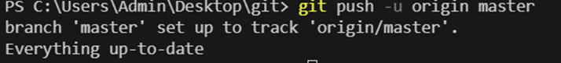

ОЦЕНКА 5
Создала ветку branch1

Переключилась на нее

Выполнила команду  echo "This is a relevant fact" > file.txt

Закоммитила  это изменение

Переключилась на главную ветку

Выполнила команду

Закоммитила именения в master

Вот что вывел git log --oneline --graph –all

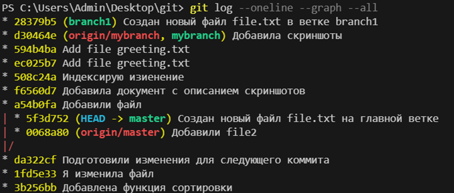

Использовала команду git merge чтобы смержить ветку branch1 в master (получла конфликт это норм)

Находимся в ветке master, есть неразрешенные конфликты слияния, файл file.txt имеет конфликт - изменен в обеих ветках, git предлагает исправить конфликты и выполнить git commit

Показывает истории коммитов

Запушила изменения

Проиндексировала файл и закоммитила

Создаю новую ветку Mergesort-Impl и переключаюсь на нее

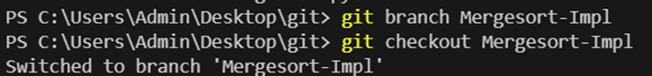

Содержимое файла mergesort.py заменила на код из righty.py и закоммитила

Перешла на ветку master

Поменяла все содержимое mergesort.py на lefty.py и закоммитила

Показывает историю коммитов

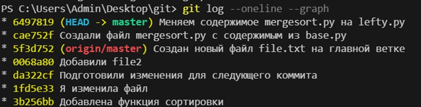

git branch показывает, что я нахожусь на ветке master

Смержила  Mergesort-Impl в master

После исправления всех merge конфликтов запушила в master изменения

